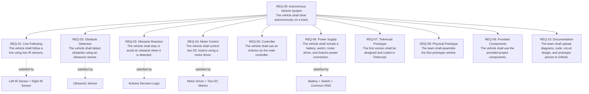

# Requirement Diagram – v1

```mermaid
flowchart TD
    R0["REQ-00: Autonomous Vehicle System<br/>The vehicle shall drive autonomously on a track."]

    R1["REQ-01: Line Following<br/>The vehicle shall follow a line using two IR sensors."]
    R2["REQ-02: Obstacle Detection<br/>The vehicle shall detect obstacles using an ultrasonic sensor."]
    R3["REQ-03: Obstacle Reaction<br/>The vehicle shall stop or avoid an obstacle when it is detected."]
    R4["REQ-04: Motor Control<br/>The vehicle shall control two DC motors using a motor driver."]
    R5["REQ-05: Controller<br/>The vehicle shall use an Arduino as the main controller."]
    R6["REQ-06: Power Supply<br/>The vehicle shall include a battery, switch, motor driver, and Arduino power connection."]
    R7["REQ-07: Tinkercad Prototype<br/>The first version shall be designed and coded in Tinkercad."]
    R8["REQ-08: Physical Prototype<br/>The team shall assemble the first prototype vehicle."]
    R9["REQ-09: Provided Components<br/>The vehicle shall use the provided project components."]
    R10["REQ-10: Documentation<br/>The team shall upload diagrams, code, circuit design, and prototype picture to GitHub."]

    R0 --> R1
    R0 --> R2
    R0 --> R3
    R0 --> R4
    R0 --> R5
    R0 --> R6
    R0 --> R7
    R0 --> R8
    R0 --> R9
    R0 --> R10

    R1 -.satisfied by.-> S1["Left IR Sensor + Right IR Sensor"]
    R2 -.satisfied by.-> S2["Ultrasonic Sensor"]
    R3 -.satisfied by.-> S3["Arduino Decision Logic"]
    R4 -.satisfied by.-> S4["Motor Driver + Two DC Motors"]
    R6 -.satisfied by.-> S5["Battery + Switch + Common GND"]
```
