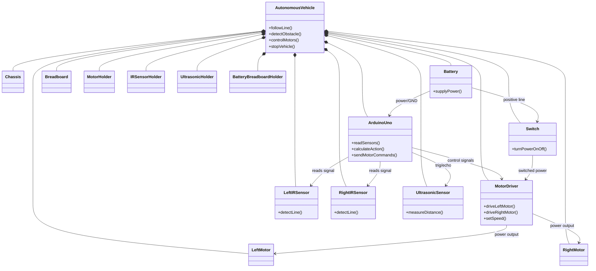

# Block Definition Diagram (BDD) – v1

```mermaid
classDiagram
    class AutonomousVehicle {
      +followLine()
      +detectObstacle()
      +controlMotors()
      +stopVehicle()
    }

    class Chassis
    class ArduinoUno {
      +readSensors()
      +calculateAction()
      +sendMotorCommands()
    }

    class MotorDriver {
      +driveLeftMotor()
      +driveRightMotor()
      +setSpeed()
    }

    class LeftMotor
    class RightMotor
    class LeftIRSensor {
      +detectLine()
    }
    class RightIRSensor {
      +detectLine()
    }
    class UltrasonicSensor {
      +measureDistance()
    }
    class Battery {
      +supplyPower()
    }
    class Switch {
      +turnPowerOnOff()
    }
    class Breadboard
    class MotorHolder
    class IRSensorHolder
    class UltrasonicHolder
    class BatteryBreadboardHolder

    AutonomousVehicle *-- Chassis
    AutonomousVehicle *-- ArduinoUno
    AutonomousVehicle *-- MotorDriver
    AutonomousVehicle *-- LeftMotor
    AutonomousVehicle *-- RightMotor
    AutonomousVehicle *-- LeftIRSensor
    AutonomousVehicle *-- RightIRSensor
    AutonomousVehicle *-- UltrasonicSensor
    AutonomousVehicle *-- Battery
    AutonomousVehicle *-- Switch
    AutonomousVehicle *-- Breadboard
    AutonomousVehicle *-- MotorHolder
    AutonomousVehicle *-- IRSensorHolder
    AutonomousVehicle *-- UltrasonicHolder
    AutonomousVehicle *-- BatteryBreadboardHolder

    ArduinoUno --> LeftIRSensor : reads signal
    ArduinoUno --> RightIRSensor : reads signal
    ArduinoUno --> UltrasonicSensor : trig/echo
    ArduinoUno --> MotorDriver : control signals
    MotorDriver --> LeftMotor : power output
    MotorDriver --> RightMotor : power output
    Battery --> Switch : positive line
    Switch --> MotorDriver : switched power
    Battery --> ArduinoUno : power/GND
```
