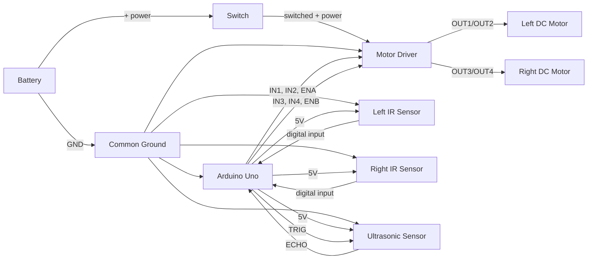

# Internal Block Diagram (IBD) – v1

```mermaid
flowchart LR
    Battery["Battery"]
    Switch["Switch"]
    Arduino["Arduino Uno"]
    Driver["Motor Driver"]
    LM["Left DC Motor"]
    RM["Right DC Motor"]
    LIR["Left IR Sensor"]
    RIR["Right IR Sensor"]
    US["Ultrasonic Sensor"]
    GND["Common Ground"]

    Battery -- "+ power" --> Switch
    Switch -- "switched + power" --> Driver
    Battery -- "GND" --> GND
    GND --> Driver
    GND --> Arduino
    GND --> LIR
    GND --> RIR
    GND --> US

    Arduino -- "5V" --> LIR
    Arduino -- "5V" --> RIR
    Arduino -- "5V" --> US

    LIR -- "digital input" --> Arduino
    RIR -- "digital input" --> Arduino
    Arduino -- "TRIG" --> US
    US -- "ECHO" --> Arduino

    Arduino -- "IN1, IN2, ENA" --> Driver
    Arduino -- "IN3, IN4, ENB" --> Driver

    Driver -- "OUT1/OUT2" --> LM
    Driver -- "OUT3/OUT4" --> RM
```
