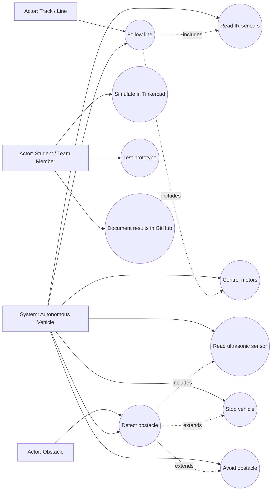

# Use Case Diagram – v1

```mermaid
flowchart LR
    Student["Actor: Student / Team Member"]
    Track["Actor: Track / Line"]
    Obstacle["Actor: Obstacle"]
    Vehicle["System: Autonomous Vehicle"]

    UC1(("Follow line"))
    UC2(("Detect obstacle"))
    UC3(("Stop vehicle"))
    UC4(("Avoid obstacle"))
    UC5(("Control motors"))
    UC6(("Read IR sensors"))
    UC7(("Read ultrasonic sensor"))
    UC8(("Simulate in Tinkercad"))
    UC9(("Test prototype"))
    UC10(("Document results in GitHub"))

    Student --> UC8
    Student --> UC9
    Student --> UC10

    Track --> UC1
    Obstacle --> UC2

    Vehicle --> UC1
    Vehicle --> UC2
    Vehicle --> UC3
    Vehicle --> UC4
    Vehicle --> UC5
    Vehicle --> UC6
    Vehicle --> UC7

    UC1 -.includes.-> UC6
    UC1 -.includes.-> UC5
    UC2 -.includes.-> UC7
    UC2 -.extends.-> UC3
    UC2 -.extends.-> UC4
```
