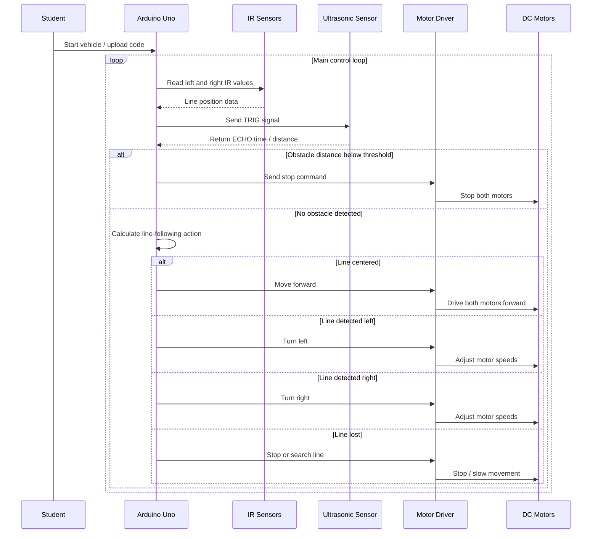

# Sequence Diagram – v1

```mermaid
sequenceDiagram
    participant User as Student
    participant Arduino as Arduino Uno
    participant IR as IR Sensors
    participant US as Ultrasonic Sensor
    participant Driver as Motor Driver
    participant Motors as DC Motors

    User->>Arduino: Start vehicle / upload code
    loop Main control loop
        Arduino->>IR: Read left and right IR values
        IR-->>Arduino: Line position data

        Arduino->>US: Send TRIG signal
        US-->>Arduino: Return ECHO time / distance

        alt Obstacle distance below threshold
            Arduino->>Driver: Send stop command
            Driver->>Motors: Stop both motors
        else No obstacle detected
            Arduino->>Arduino: Calculate line-following action
            alt Line centered
                Arduino->>Driver: Move forward
                Driver->>Motors: Drive both motors forward
            else Line detected left
                Arduino->>Driver: Turn left
                Driver->>Motors: Adjust motor speeds
            else Line detected right
                Arduino->>Driver: Turn right
                Driver->>Motors: Adjust motor speeds
            else Line lost
                Arduino->>Driver: Stop or search line
                Driver->>Motors: Stop / slow movement
            end
        end
    end
```
