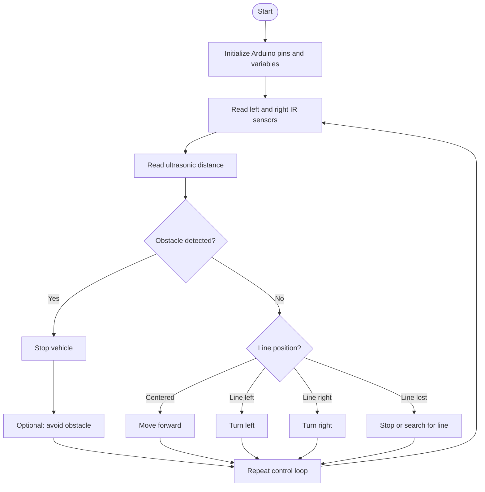

# Activity Diagram – v1

```mermaid
flowchart TD
    A([Start])
    B[Initialize Arduino pins and variables]
    C[Read left and right IR sensors]
    D[Read ultrasonic distance]
    E{Obstacle detected?}
    F[Stop vehicle]
    G[Optional: avoid obstacle]
    H{Line position?}
    I[Move forward]
    J[Turn left]
    K[Turn right]
    L[Stop or search for line]
    M[Repeat control loop]

    A --> B
    B --> C
    C --> D
    D --> E

    E -- Yes --> F
    F --> G
    G --> M

    E -- No --> H
    H -- Centered --> I
    H -- Line left --> J
    H -- Line right --> K
    H -- Line lost --> L

    I --> M
    J --> M
    K --> M
    L --> M
    M --> C
```
