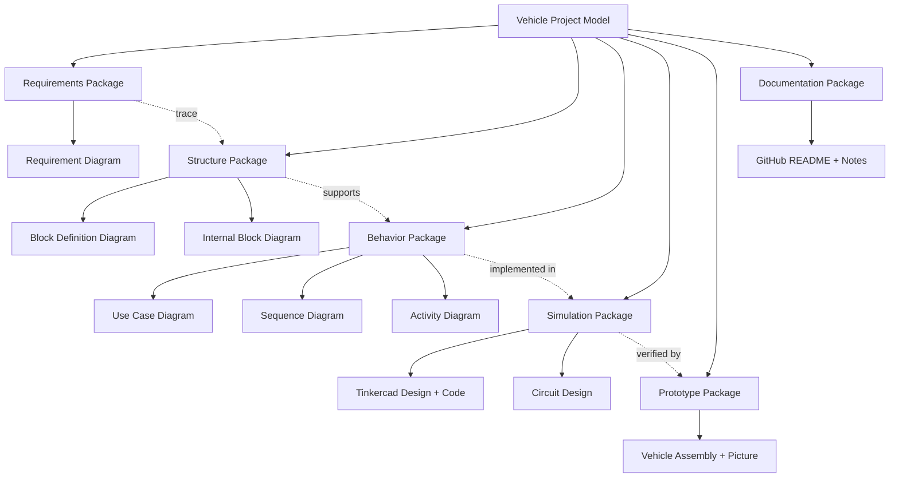

# Package Diagram – v1

```mermaid
flowchart TD
    P0["Vehicle Project Model"]

    P1["Requirements Package"]
    P2["Structure Package"]
    P3["Behavior Package"]
    P4["Simulation Package"]
    P5["Prototype Package"]
    P6["Documentation Package"]

    R["Requirement Diagram"]
    BDD["Block Definition Diagram"]
    IBD["Internal Block Diagram"]
    UC["Use Case Diagram"]
    SEQ["Sequence Diagram"]
    ACT["Activity Diagram"]
    TIN["Tinkercad Design + Code"]
    CIR["Circuit Design"]
    ASM["Vehicle Assembly + Picture"]
    GIT["GitHub README + Notes"]

    P0 --> P1
    P0 --> P2
    P0 --> P3
    P0 --> P4
    P0 --> P5
    P0 --> P6

    P1 --> R
    P2 --> BDD
    P2 --> IBD
    P3 --> UC
    P3 --> SEQ
    P3 --> ACT
    P4 --> TIN
    P4 --> CIR
    P5 --> ASM
    P6 --> GIT

    P1 -.trace.-> P2
    P2 -.supports.-> P3
    P3 -.implemented in.-> P4
    P4 -.verified by.-> P5
```
