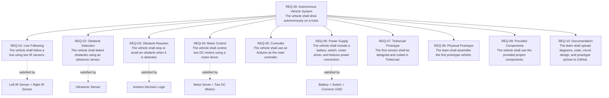
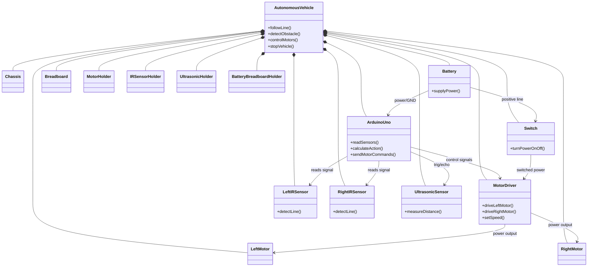
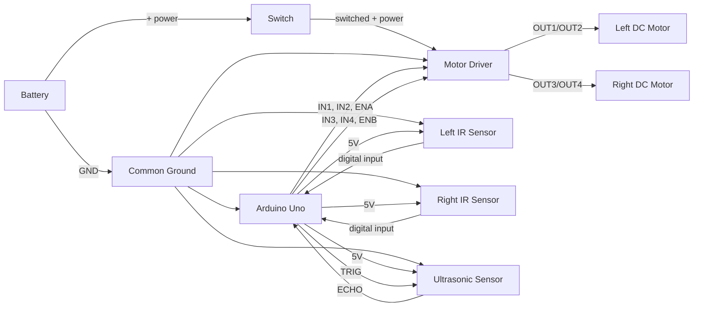
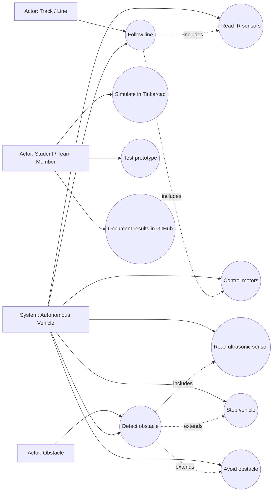
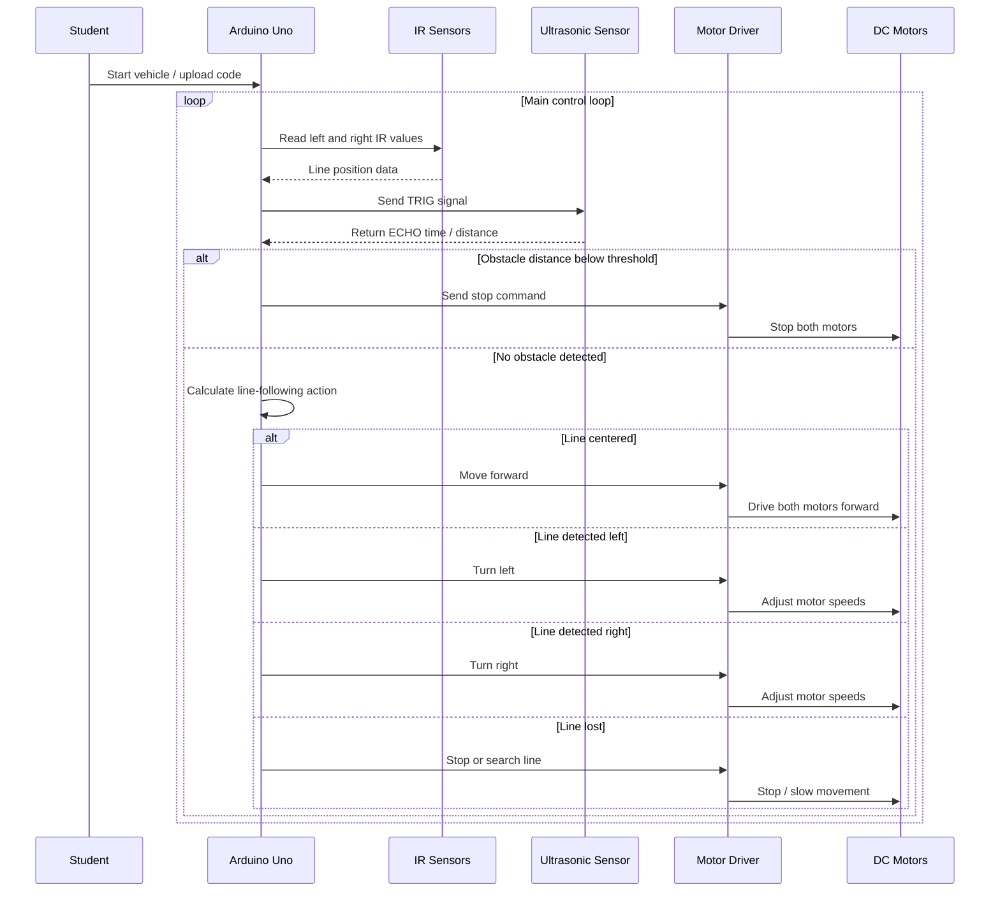
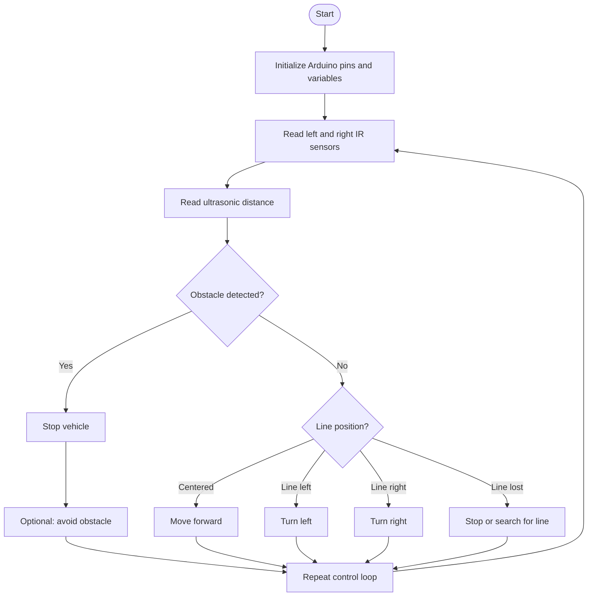
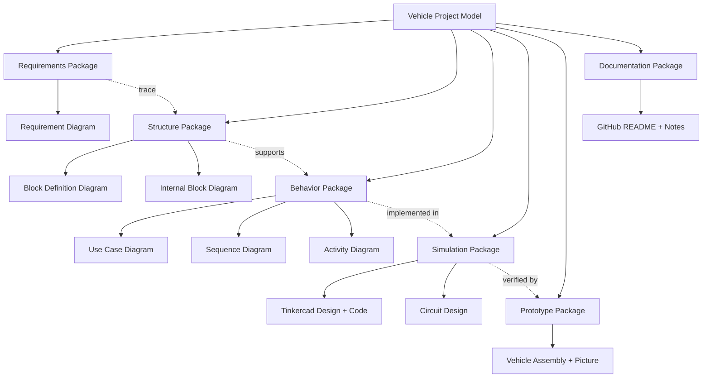

# Requirement Diagram – v1

---

# Block Definition Diagram (BDD) – v1

---

# Internal Block Diagram (IBD) – v1

---

# Use Case Diagram – v1

---

# Sequence Diagram – v1

---

# Activity Diagram – v1

---

# Package Diagram – v1

